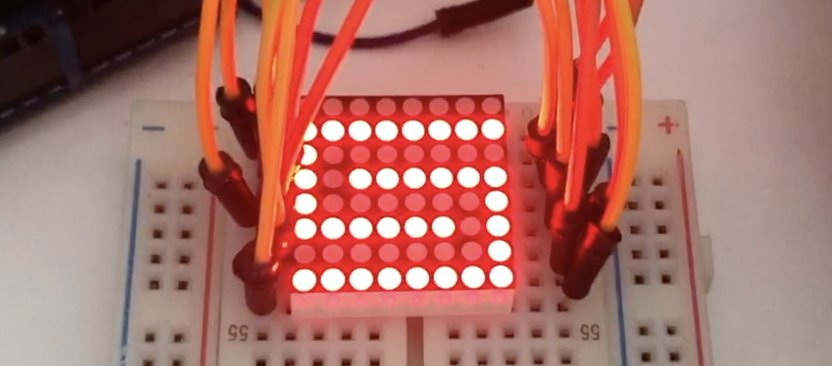
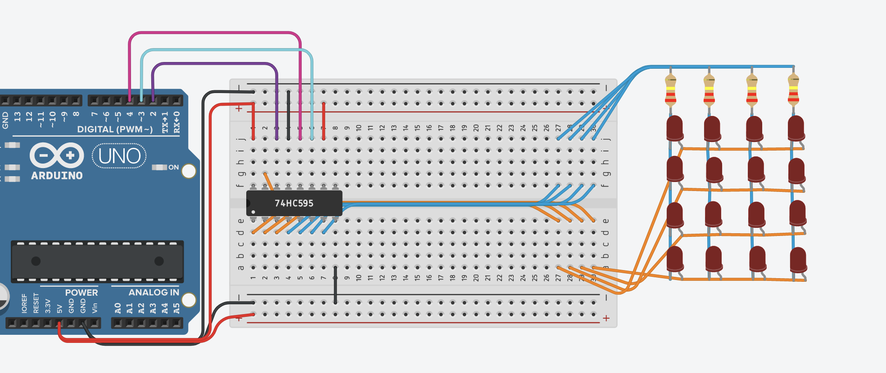
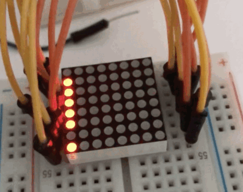

# dot-matrix display project

---

In this project, we learn how displays work by assembling an 8x8 pixel dot-matrix display and writing code to draw images and animations on it.

The completed project uses two shift registers to send row and column data to the display.
With a potentiometer, makers can vary the **refresh rate** of the display to observe how the image is drawn through a series of scan lines.

The code for each step below is available in the git history of this branch.

## Step 1
One shift register, 4 rows & 4 columns of the display wired up.

## Step 2
Quickly alternating pattern that cannot be drawn in just one `shiftOut`.
Use a potentiometer to vary the 'refresh rate'.

## Step 3
Both shift registers wired up, along with entire dot matrix display.
Pattern extended to whole display.

## Step 4
Add images to draw on the display.
Code binary logic to change images to bits to `shiftOut`.

## Step 5
Add animation whose frames are updated separately from display.

## Step 6
Use a timed interrupt to draw scan lines so that other code can run concurrently,
without worrying about messing up the image.
